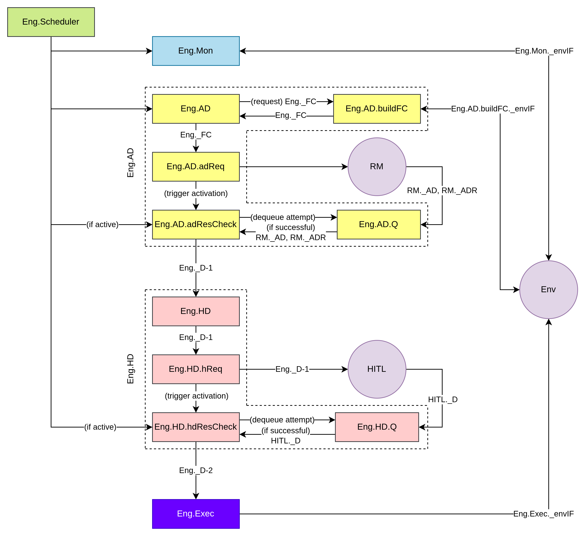

<h1>Engine Architecture - V1</h1>

> **Module code**: `Eng`

> **Relevant context**: [`ideation/architecture/README.md`](./README.md); defines:
>
> - `RM` (reasoning model) + submodules/components
> - `HITL` (human-in-the-loop) + submodules/components

---

**Contents**:

- [Diagram](#diagram)
- [`Eng.Scheduler` (Scheduler)](#engscheduler-scheduler)
- [`Eng.Mon` (Monitoring)](#engmon-monitoring)
  - [`Eng.Mon._envIF`](#engmon_envif)
- [`Eng.AD` (Agent Decision)](#engad-agent-decision)
  - [`Eng._FC` (Forecast Context)](#eng_fc-forecast-context)
  - [`Eng.buildFC` (Build Context)](#engbuildfc-build-context)
    - [`Eng.AD.buildFC._envIF`](#engadbuildfc_envif)
  - [`Eng.AD.adReq` (Agent Decision Request)](#engadadreq-agent-decision-request)
  - [`Eng.AD.Q` (Agent Decision Response Queue)](#engadq-agent-decision-response-queue)
  - [`Eng.AD.adResCheck` (Agent Decision Response Check)](#engadadrescheck-agent-decision-response-check)
- [`Eng._D-1` (Engine Decision Object - V1)](#eng_d-1-engine-decision-object---v1)
- [`Eng.HD` (Human Decision)](#enghd-human-decision)
  - [`Eng.HD.hdReq` (Human Decision Request)](#enghdhdreq-human-decision-request)
  - [`Eng.HD.Q` (Human Decision Response Queue)](#enghdq-human-decision-response-queue)
  - [`Eng.HD.hdResCheck` (Human Decision Response Check)](#enghdhdrescheck-human-decision-response-check)
- [`Eng._D-2` (Engine Decision Object - V2)](#eng_d-2-engine-decision-object---v2)
- [`Eng.Exec` (Executor)](#engexec-executor)
  - [`Eng.Exec._envIF`](#engexec_envif)

---

# Diagram
> **NOTE**: Details are given in the following sections.

> Editable XML file for the diagram: [`ideation/_resources/engine-architecture-v1.drawio`](../_resources/engine-architecture-v1.drawio)

# `Eng.Scheduler` (Scheduler)
Core loop of the engine that:

- Synchronises engine actions with discrete time steps
- Schedules engine actions (including dispatching of asynchronous threads)

# `Eng.Mon` (Monitoring)
Involves monitoring process(es) that are:

- Synchronous
- High frequency (ideally per engine tick)

These processes can be:

- Table read queries (especially for operational tables)   ... *pull approach*
- Received notifications/events   ... *push approach*

## `Eng.Mon._envIF`
Requirement for a 2-way interface with the environment for:

- Pull approach data collection
- Push approach data collection

# `Eng.AD` (Agent Decision)
## `Eng._FC` (Forecast Context)
Context needed for the forecast model (serves as its primary input).

## `Eng.buildFC` (Build Context)
Builds `Eng._FC`. May need to interact with `Env`.

### `Eng.AD.buildFC._envIF`
Requirement for a 2-way interface with the environment for building `Eng._FC`.

## `Eng.AD.adReq` (Agent Decision Request)
- Asynchronous
- Triggered per n engine ticks (configurable)

> **NOTE**: If `Eng.AD.adResCheck` is not active, there are 2 approaches:
>
> 1. Do not activate `Eng.AD.adReq`
> 2. Activate `Eng.AD.adReq` but:
>    - Add requests to a request queue
>    - Ensure `RM` reads from this request queue
>
> Currently, we are likely to pursue approach 1 due to its ease.

## `Eng.AD.Q` (Agent Decision Response Queue)
Queue to hold responses from `RM`:

- Stores the newest decisions at its queue head
- Deletes any item consumed from its queue tail

> **NOTE**: Deletion upon consume is ideal as decisions need not be repeated.

## `Eng.AD.adResCheck` (Agent Decision Response Check)
- Synchronous
- Reads from the queue tail of `Eng.AD.Q`
- High-to-medium frequency (ideally per engine tick)
- Activates upon `Eng.AD.adReq` trigger
- Deactivates once required responses from `RM` is received; required responses are:
  - `RM._AD` (agent decisions)
  - `RM._ADR` (agent decision reasoning (human-readable))

# `Eng._D-1` (Engine Decision Object - V1)
Consolidated `RM._AD` and `RM._ADR` after:

- Structural validation (ensuring the expected contracts are adhered to)
- Logical validation (ensuring values are within a valid range)

# `Eng.HD` (Human Decision)
## `Eng.HD.hdReq` (Human Decision Request)
- Asynchronous
- Triggered upon receiving decision response

> **NOTE**: If `Eng.HD.hdResCheck` is not active, there are 2 approaches:
>
> 1. Do not activate `Eng.HD.hdReq`
> 2. Activate `Eng.HD.hdReq` but:
>    - Add requests to a request queue
>    - Ensure `HITL` reads from this request queue
>
> Currently, we shall pursue approach 2 to ensure:
>
> - All agent decisions will be reviewed by the human, despite human delay
> - 1 or more agent decisions can be edited/cancelled by the human as a batch

## `Eng.HD.Q` (Human Decision Response Queue)
Queue to hold responses from `HITL`:

- Stores the newest decisions at its queue head
- Deletes any item consumed from its queue tail

> **NOTE**: Deletion upon consume is ideal as decisions need not be repeated.

## `Eng.HD.hdResCheck` (Human Decision Response Check)
- Synchronous
- Reads from the queue tail of `Eng.HD.Q`
- High-to-medium frequency (ideally per engine tick)
- Activates upon `Eng.HD.hdReq` trigger
- Deactivates once response from `HITL` (`HITL._D`) is received

# `Eng._D-2` (Engine Decision Object - V2)
`HITL._D` after passing structural and logical validation.

# `Eng.Exec` (Executor)
Executes the decisions in `Eng._D-2` via `Eng.Mon._envIF`.

## `Eng.Exec._envIF`
Requirement for a 1-way interface with the environment for decision execution.
