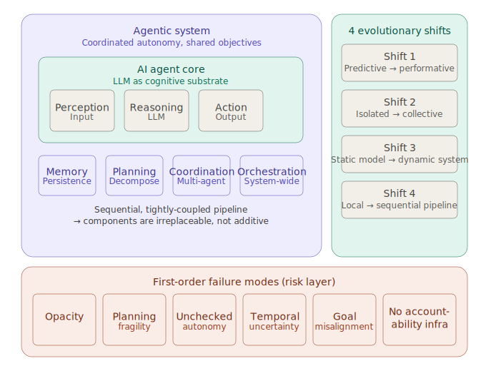

<h1>Agentic AI for Data Platform Engineering: <i>A Strategic Exploration</i></h1>

***Literature Review***

This is literature review for:

- [`problemSpaceExploration.1-definingTheProblemSpace.md`](./problemSpaceExploration.1-definingTheProblemSpace.md)
- [`problemSpaceExploration.2-ethicalAndPracticalConsiderations.md`](./problemSpaceExploration.2-ethicalAndPracticalConsiderations.md)

[Based on a conversation with Claude AI (Sonnet 4.6)](https://claude.ai/share/17ac0ac7-6fe3-4c2c-b38b-1954aec7f8b1)

---

**Contents**:

- [Interpreting Agentic Systems](#interpreting-agentic-systems)
  - [Overall Structure](#overall-structure)
  - [Evaluation](#evaluation)
  - [Key Takeaways for Databricks-Native Agentic Systems](#key-takeaways-for-databricks-native-agentic-systems)
    - [1. *Tightly-coupled pipeline is the primary design constraint in Databricks*](#1-tightly-coupled-pipeline-is-the-primary-design-constraint-in-databricks)
    - [2. *Memory is where Databricks has the clearest native leverage*](#2-memory-is-where-databricks-has-the-clearest-native-leverage)
    - [3. *Orchestration is where emergent risk concentrates*](#3-orchestration-is-where-emergent-risk-concentrates)
    - [4. *Post-hoc explainability tools are structurally insufficient here*](#4-post-hoc-explainability-tools-are-structurally-insufficient-here)
    - [5. *"Shared objectives, not isolated tasks" is a useful scoping heuristic*](#5-shared-objectives-not-isolated-tasks-is-a-useful-scoping-heuristic)
    - [6. The framework types section is the gap to fill](#6-the-framework-types-section-is-the-gap-to-fill)
  - [Risk Layer Reference](#risk-layer-reference)
  - [Conceptual Checkpoints (from the paper)](#conceptual-checkpoints-from-the-paper)

---

# Interpreting Agentic Systems
> **Reference**: [`interpreting-agentic-systems--beyond-model-explanations-to-system-level-accountability.md`](../literature/interpreting-agentic-systems--beyond-model-explanations-to-system-level-accountability.md)

> Based on: Interpreting Agentic Systems: Beyond Model Explanations to System-Level Accountability
> **NOTE**: *This document summarises analysis of the paper's condensed notes, not the paper itself.*

## Overall Structure

## Evaluation
Strong conceptual scaffolding - the evolutionary framing (ML paradigms -> agentic systems) and the risk taxonomy are genuinely useful for problem-space exploration. For a Databricks context, the document's level of abstraction is appropriate as a mental model layer, but it stops short of the architectural specificity needed for implementation decisions.

## Key Takeaways for Databricks-Native Agentic Systems
### 1. *Tightly-coupled pipeline is the primary design constraint in Databricks*

The paper's most actionable insight is [Shift 4 & Steps toward Integrated, Tightly-Coupled Systems](../literature/interpreting-agentic-systems--beyond-model-explanations-to-system-level-accountability.md#shift-4--steps-toward-integrated-tightly-coupled-systems): system performance is *multiplicative* across components, not additive. In Databricks terms, this means a weak retrieval layer doesn't just slow down your RAG pipeline - it degrades every downstream agent that depends on it. When scoping a Databricks agentic system (whether using MLflow, Mosaic AI Agent Framework, or Unity Catalog-backed tools), map dependencies first and treat each component as a potential single point of failure, not just a module to swap.

### 2. *Memory is where Databricks has the clearest native leverage*
The document identifies memory (episodic, semantic, procedural) as the backbone capability that separates agentic systems from one-shot models. Databricks' Delta Lake + Vector Search is a natural fit for this - persistent, versioned, queryable. When exploring the problem space, explicitly ask: *which memory layer does this component own?*

| Memory type | Databricks native primitive |
| --- | --- |
| Semantic | Vector Search |
| Procedural / structured state | Delta tables |
| Episodic (run history) | MLflow experiment tracking |

### 3. *Orchestration is where emergent risk concentrates*
The paper flags that opacity, planning fragility, and goal misalignment all compound at the orchestration layer - not within individual agents. In Databricks-native architectures, this is the orchestration logic (LangGraph, Mosaic AI workflows, or custom DAGs in Jobs).

**Practical implication**: *Invest interpretability work at the orchestration layer first, not at the individual model level. Log inter-agent message passing, not just model inputs/outputs.*

### 4. *Post-hoc explainability tools are structurally insufficient here*
The document is explicit: single-model explainability techniques (SHAP, LIME, etc.) produce "fragmented, local insights" that don't capture the temporal and interactive dynamics of multi-agent systems. For Databricks, this means MLflow's standard model logging is necessary but not sufficient - you need trace-level logging that captures the full reason-act-reflect cycle across agents.

**Right primitive**: *MLflow Tracing (LLM observability), not just experiment tracking.*

### 5. *"Shared objectives, not isolated tasks" is a useful scoping heuristic*
The distinction between an AI agent (task-specific automation) and an agentic system (coordinated autonomy toward shared objectives) gives a concrete question to ask when scoping Databricks use cases:

> *Is the goal decomposable into independent tasks, or does it require agents to maintain shared context over time?*

- **Independent tasks** → Databricks Jobs chaining
- **Shared context over time** → Stateful orchestration with Unity Catalog as the shared context layer

### 6. The framework types section is the gap to fill
The document flags graph-based, workflow-oriented, and modular frameworks as needing further clarity (see: [Key Agentic System Framework Types to Reflect Design-Changes](../literature/interpreting-agentic-systems--beyond-model-explanations-to-system-level-accountability.md#key-agentic-system-framework-types-to-reflect-design-changes)) - and this is precisely where the Databricks-specific problem space lives.

| Framework type | Databricks equivalent | Design implication |
|---|---|---|
| Graph-based | LangGraph | Formalised inter-agent dependencies |
| Modular | Mosaic AI Agent Framework | Swappable, composable components |
| Workflow-oriented | Databricks Workflows / Jobs | Sequential, DAG-style execution |

Choosing between them is a design decision about ***how tightly you want to couple planning and execution*** - not just a technical preference.

## Risk Layer Reference
The 6 first-order failure modes the paper identifies, in a Databricks context:

| Risk | What it means in practice |
|---|---|
| Opacity | Inter-agent message passing is unlogged; failures are untraceable |
| Planning fragility | Task decomposition breaks on edge cases with no fallback |
| Unchecked autonomy | Agents act on stale or conflicting context without human checkpoints |
| Temporal uncertainty | Long-horizon tasks accumulate state drift across sessions |
| Goal misalignment | Sub-agents optimise locally, diverging from the system objective |
| No accountability infrastructure | No audit trail at the orchestration layer for compliance or debugging |

## Conceptual Checkpoints (from the paper)
**Checkpoint 1 - Key properties to account for**:

- Emergent behaviour of agents and agentic systems
- System-level actions (rather than individual agent actions)
- Shared context

**Checkpoint 2 - Core argument on interpretability**:

Transparency and interpretability cannot remain optional, after-the-fact diagnostics. They must be treated as foundational design requirements embedded in the architecture and lifecycle of agentic systems.