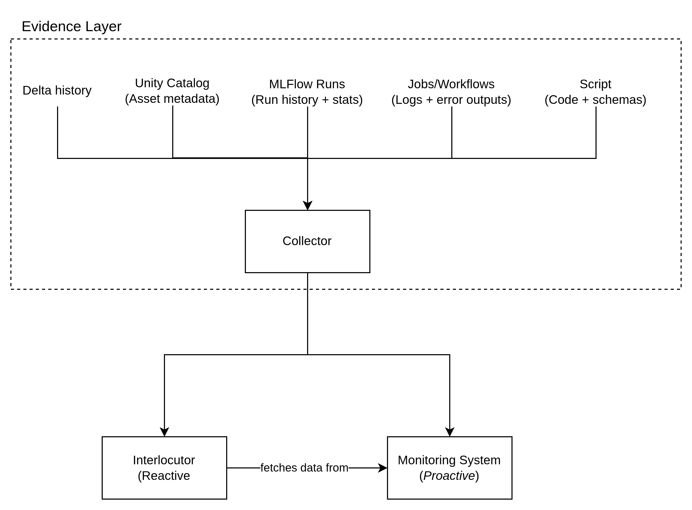

<h1>PROPOSAL 1: Platform-Engineering: Platform Prashanth</h1>

> **ABANDONED**

---

**Contents**:

- [Context](#context)
- [Purpose](#purpose)
- [Component 1: Monitoring](#component-1-monitoring)
- [Component 2: Interlocuter](#component-2-interlocuter)
- [Remarks on Component 1 \& 2](#remarks-on-component-1--2)
- [Architecture](#architecture)
- [Alignment with Considerations](#alignment-with-considerations)
  - [*Future-vision*](#future-vision)
  - [*Databricks free-edition compatibility*](#databricks-free-edition-compatibility)
  - [*External platform compatibility*](#external-platform-compatibility)
  - [*End-to-end consideration*](#end-to-end-consideration)
  - [*Compatibility with the domain-specific proposal*](#compatibility-with-the-domain-specific-proposal)
  - [*Minimising LLM use complexity*](#minimising-llm-use-complexity)
  - [*Autonomy tier and write surface*](#autonomy-tier-and-write-surface)
  - [*Ethical-practical alignment*](#ethical-practical-alignment)

---

# Context
GOAL: Solve the problem of platform opacity, as discussed in:

["Interpreting Agentic Systems", `problemSpaceExploration.3-literatureReview.md`](./problemSpaceExploration.3-literatureReview.md#interpreting-agentic-systems)

It also draws from the following proposals:

- [`proposal.dbxMonitoringReportingSummarising.md`](./proposal.dbxMonitoringReportingSummarising.md)
- ["Proposal 5 - The Platform Whisperer", `proposalSet.2.md`](./proposalSet.2.md#proposal-5---the-platform-whisperer)

# Purpose
Demonstrate a platform that:

- Provides performance visibility at different resolutions
    - Ground truth (produced logs and metrics)
    - Individual summary (for individual issues, job-runs, etc.)
    - Collective summary (for issues faced across a time period, etc.)
- Provides a means respond to human queries about performance
- Inputs human feedback into context for future queries <br> E.g.: *Specific issues or issue-resolutions, new requirements for performance*

# Component 1: Monitoring
Watches the platform and pushes insight when something goes wrong

# Component 2: Interlocuter
- Pulls insight on demand
- Listens to the engineer

The interlocutor is a ReAct agent:

- It reasons, acts (queries a tool), observes the result, and reasons again <br> ... *until it reaches a confidence threshold or determines that evidence is insufficient*

It has 3 input channels

- Live user queries
- Structured data stores produced by the monitoring component
- Feedback store (prior engineer corrections and annotations)

It has 1 output channel:

*Structured, evidence-grounded response logged to MLflow Tracing.*

The key design constraint is that it only answers what it can evidence.

***"Insufficient evidence" is a 1st-class output, not a fallback.***

# Remarks on Component 1 & 2
Neither is complete without the other:

- Monitoring without ways to interrogate it just produces more noise
- Interlocuter without proactive data only helps people who know what to ask

# Architecture
Overall architecture:



Monitoring component architecture:


Interlocutor component architecture:

```
[User query - plain English]
         |
         v
[Context loader]
  Reads from:
  - Feedback store (prior corrections, engineer notes)
  - Meta-report table (periodic summaries from Monitoring)
  - Session history (current conversation turns)
         |
         v
[ReAct loop - single agent]
  Tools available:
  - query_delta_history(table, time_range)
  - query_unity_catalog(asset)
  - query_mlflow_runs(filters)
  - query_jobs_log(job_id, time_range)
  - query_issue_reports(filters)       <- Monitoring component's output
  - query_meta_reports(period)         <- Monitoring component's output

  Loop:  Reason -> Act (call tool) -> Observe
         -> Reason again
         -> Until: confidence threshold met
                  OR max iterations reached
                  OR no further tools can help
         |
         v
[Response composer]
  Outputs one of:
  - Evidenced answer
      Direct answer
      Cited evidence (tool results, timestamps, links)
      Confidence level: high / medium
      Full reasoning chain -> MLflow Traced
  - Insufficient evidence response
      What was searched
      What was not found
      Open questions for human follow-up
         |
         v
[Feedback capture]  <-----------------------------------+
  Engineer may:                                         |
  - Confirm answer                                      |
  - Correct answer                                      |
  - Add context ("this is a known issue, see ticket X") |
  Stored in: feedback_store table                       |
  Ingested by: context loader on next query ------------+
```

# Alignment with Considerations
Considerations and constraints laid out here:

- Future-vision
- Databricks free-edition compatible
- Connection to/account for external platforms (e.g. S3, Kafka, etc.)
- End-to-end consideration for:
    - Data sources
    - Data movement
    - Platform evolution
- Should work well with the chosen domain-specific proposal
- Should minimise LLM use complexity
- Autonomy tier (read-only, Tier 2) <br> **Reference**: ["Autonomy Boundaries and Human Oversight", `problemSpaceExploration.2-ethicalAndPracticalConsiderations.md`](./problemSpaceExploration.2-ethicalAndPracticalConsiderations.md#22-autonomy-boundaries-and-human-oversight)
- Ethical-practical alignment:
    - Explainability
    - Accountability
    - Confidence levels

## *Future-vision*
The architecture is designed to extend, not to be replaced. The shared
evidence layer (query wrappers, structured log store) becomes reusable
infrastructure for future agents. The feedback store compounds over time -
the interlocutor gets more context-aware as engineers use it. The
meta-analysis layer (in the monitoring component) naturally absorbs new issue categories without structural changes. Version extensions (multi-workspace, proactive alerts, natural language pipeline triggers) are additive, not architectural rewrites.

## *Databricks free-edition compatibility*
All components use primitives available in the Databricks free edition: Delta tables (log and report storage), MLflow (run tracking and tracing), Unity Catalog (asset metadata), and Jobs/Workflows (event triggers). No paid features - Databricks SQL warehouse, Model Serving endpoints, or premium Unity Catalog governance tiers - are required for the prototype. The notebook chat interface requires no deployment surface beyond a running cluster.

## *External platform compatibility*
External platforms (S3, Kafka, JDBC sources, etc.) are accounted for at the evidence layer boundary (i.e. the Collector's input). The Collector receives log and metadata from any job or workflow regardless of its upstream source - the ingestion mechanism is the job, not the platform. A Kafka consumer job and an S3 batch job look identical to the Collector: they both produce a run record and a log. No architectural change is needed to onboard a new source type; it is documented as a job and becomes queryable automatically. For platforms that do not surface logs through Databricks Jobs, an explicit note in the evidence layer documentation (or a lightweight adapter job) suffices.

## *End-to-end consideration*
- **Data sources**: any source reachable by a Databricks job is in scope,
  including external object stores, streaming sources, and JDBC connections.
- **Data movement**: the Collector normalises raw logs into a structured
  Delta table - a single point of ingestion regardless of source variety.
- **Platform evolution**: schema changes, new job types, and new catalog
  assets are surfaced automatically through the existing query wrappers.
  The Interlocutor and Monitor do not need to be updated when the platform
  evolves; they query what is there.

## *Compatibility with the domain-specific proposal*
The warehouse reorder use-case (Proposal 1) provides a realistic and bounded workload: periodic ingestion jobs, schema evolution on the promotions table, downstream pipeline dependencies, MLflow-tracked model runs. Every component of this proposal has a concrete exercise in that context - the Monitor catches reorder pipeline failures, the Interlocutor answers questions about reorder volume anomalies, and the feedback store captures domain-specific corrections (e.g. "this spike is expected during promotions"). The two proposals share infrastructure and reinforce each other's demo value.

## *Minimising LLM use complexity*
LLM involvement is deliberately narrow and well-bounded. Each agent is a single ReAct loop calling read-only tool wrappers - there is no RAG pipeline, no embedding index, no vector store, and no fine-tuning. The Monitoring agent's LLM call is scoped to error classification and root cause reasoning over a bounded log. The Interlocutor's LLM call is scoped to reasoning over retrieved tool results. Both use the same model via thesame API. MLflow Tracing logs every call, making LLM behaviour inspectable and debuggable without additional tooling.

## *Autonomy tier and write surface*
Both agents are Tier 2 (autonomous action within a bounded, reversible scope). All tool calls are read-only. There is no write surface exposed to either agent - they query, classify, and summarise; they do not modify tables, trigger jobs, or alter permissions. This is a hard constraint, not a default, and is enforced at the tool wrapper level.

## *Ethical-practical alignment*
- **Explainability**: every response includes a full reasoning chain logged via MLflow Tracing. The interlocutor's citations link directly to the tool results that support each claim.
- **Accountability**: confidence levels (high / medium / insufficient) are mandatory on every interlocutor response. "Insufficient evidence" is surfaced explicitly, not suppressed. The monitor's issue reports include the raw log data that triggered each classification.
- **Avoiding the appearance of transparency**: in line with the conflict-between-explainability-and-accountability literature, the system ties every claim to a retrievable, timestamped source. Confidence is not a stylistic label - it reflects whether the evidence actually supports the answer.
- **Human feedback as a correction mechanism**: the feedback store ensures that engineer judgement can override or supplement agent conclusions, keeping humans in the loop without requiring architectural intervention.
