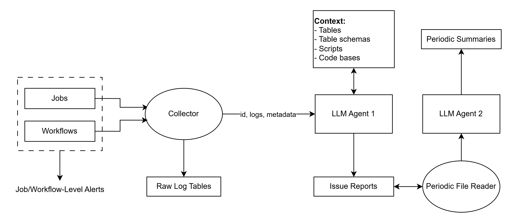

**Proposal**

<h1>Dbx Monitoring, Reporting, Summarising</h1>

---

**Contents**:

- [Problem Statement](#problem-statement)
- [Proposed Solution](#proposed-solution)
- [Proposed Architecture](#proposed-architecture)

---

# Problem Statement
Consider a Databricks workspace with multiple:

- Catalogs and schemas
- Data sources
- Jobs
- Workflows

The context is diverse, there are multiple of failure, and if we are considering a use-case involving repeated, maybe frequent data ingestion/processing tasks across a long period, tracing issues to root causes or even getting an overview of the issues and their natures can be very taxing (in terms of time and effort). Alerting and monitoring can be set up at job and workflow levels, but even these are component-based, cannot draw on the context and may themselves be numerous, hard to filter/query and serve more as an indication of issues than a clear overview of them.

# Proposed Solution
The core system would do as follows:

- Analyses error logs (for jobs and workflows)
- Stores error logs in a structured way (e.g. in a table)   *This enables future querying, analysis and auditing*
- Identifies potential areas of interest, e.g.:
    - A table schema-related issue? Need context about tables
    - A logic issue in a script? Need context about code
    - A permissions issue? Need context about permissions
    - A non-logical issue (e.g. connectivity)? Indicate as such
- Seeks information about these areas and generates report of:
    - Possible root causes
    - Possible fixes

However, over time, this can get dense.

Hence, we can have a meta-analysis system that:

- Periodically (e.g. every week) goes over generated error reports
- Generates a meta-report to give an overview on issues encountered

As for alerts, we can have multiple levels:

- Job/workflow level
- Issue analysis system level
- Meta-analysis system level

# Proposed Architecture

- Jobs/workflows produce job/workflow-level alerts
- Upon completion/error, they send data to `Collector`
- `Collector` does the following:
    - Store raw log data in a table/tables
    - Send ID, log data and metadata to `LLM Agent 1`
- `LLM Agent 1` does the following:
    - Analyse given data
    - Query and obtain context as necessary, which includes:
        - Tables
        - Table schemas
        - Scripts
        - Code bases
    - Produce and store issue reports
    - Send notification about issue report
- `Periodic File Reader` does the following:
    - Read stored issue reports periodically
    - Ingest files beyond what have been read prior
    - Send these files to `LLM Agent 2`
- `LLM Agent 2` does the following:
    - Analyse the given issue report files
    - Create and stores a period-specific summary of issues
    - Send notification about summary