<h1>Databricks Mosaic AI - Agentic Architecture Reference</h1>

> **AI-Use Disclaimer**: This document was generated by Claude Sonnet 4.6, with the following context and prompts.
>
> **Context**: [`knowledgeBase/_resources/context-for-mosaicAiArchitecture.md`](../_resources/context-for-mosaicAiArchitecture.md)
>
> **Prompt 1**:

```
I shall present you with a context. Note that my ultimate purpose is to explore options for my particular warehouse reorder problem, which involves my particular warehouse simulation setup. But I shall get into the domain-specific part later. For now, just consider the following context, as I want to have an investigating back-and-forth about this.

<attachment of context file>
```

> **Prompt 2**:

```
Before we move ahead, I want to document your response, for reference purposes. However, as you generate an MD file for this, please ensure that your claims are properly referenced. First, validate your claims with references, and flag any claims not properly referenced. Then, create the MD file organising all your points, specifically the following:

- A mapping between:
    - Tools
    - Components
    - Testing and deployment stages
    - Evaluation
- Operational summary of:
    - Each Agentic-AI-relevant Databricks component
    - How it helps in agentic solutions
- Broad architecture of an AI project involving:
    - Tools
    - Components
    - Testing and deployment stages
    - Evaluation
```

> **Prompt 3**:

```
What is AI gateway and how does it differ from using Unity Catalog?
```

> **Prompt 4**:

```
Okay, I have taken the liberty of editing the doc you generated. It is attached here. Please integrate the consideration of AI gateway, especially as discussed above, but also as another entry under the "Tools" section of the original context. Also include "Managed OAuth MCP Connectors" as another entry under the "Tools" section. Edit the given doc and provide the new MD file.

<attachment edited version of previously generated MD file>
```

---

**Contents**:

- [Reference Note](#reference-note)
- [1. What is Mosaic AI?](#1-what-is-mosaic-ai)
- [2. Tool and Component Operational Summaries](#2-tool-and-component-operational-summaries)
  - [2.1 Unity Catalog](#21-unity-catalog)
  - [2.2 MLflow](#22-mlflow)
  - [2.3 Agent Bricks](#23-agent-bricks)
  - [2.4 LangChain and LangGraph](#24-langchain-and-langgraph)
  - [2.5 LangFuse](#25-langfuse)
  - [2.6 Lakebase](#26-lakebase)
  - [2.7 Model Serving Endpoints](#27-model-serving-endpoints)
  - [2.8 Databricks Apps](#28-databricks-apps)
  - [2.9 AI Playground](#29-ai-playground)
  - [2.10 AI Gateway](#210-ai-gateway)
  - [2.11 Managed OAuth MCP Connectors](#211-managed-oauth-mcp-connectors)
- [3. Tool-to-Concern Mapping](#3-tool-to-concern-mapping)
- [4. Lifecycle Stage Mapping](#4-lifecycle-stage-mapping)
  - [Stage 1 - Foundation (Data and Governance)](#stage-1---foundation-data-and-governance)
  - [Stage 2 - Prototyping](#stage-2---prototyping)
  - [Stage 3 - Agent Construction and Logging](#stage-3---agent-construction-and-logging)
  - [Stage 4 - Deployment](#stage-4---deployment)
  - [Stage 5 - Evaluation](#stage-5---evaluation)
- [5. Broad Architecture Summary](#5-broad-architecture-summary)
- [6. Claims Requiring Further Verification](#6-claims-requiring-further-verification)

---

# Reference Note

2 sources were provided as primary references:

- **[R1]** Databricks Blog: *Agent Bricks - Governed Enterprise Agent Platform* - https://www.databricks.com/blog/agent-bricks-governed-enterprise-agent-platform
- **[R2]** Medium (AI on Databricks): *Building an Investment Assistant with the Databricks Mosaic AI Agent Framework* - https://medium.com/@AI-on-Databricks/building-an-investment-assistant-with-the-databricks-mosaic-ai-agent-framework-d2ff276a61d2

Additional sources referenced inline:

- **[R3]** Databricks Unity Catalog documentation - https://docs.databricks.com/en/data-governance/unity-catalog/index.html
- **[R4]** MLflow documentation (open-source) - https://mlflow.org/docs/latest/index.html
- **[R5]** MLflow `mlflow.evaluate()` API docs - https://mlflow.org/docs/latest/python_api/mlflow.html#mlflow.evaluate
- **[R6]** Databricks Model Serving documentation - https://docs.databricks.com/en/machine-learning/model-serving/index.html
- **[R7]** Databricks AI Playground documentation - https://docs.databricks.com/en/large-language-models/ai-playground.html
- **[R8]** LangGraph documentation - https://langchain-ai.github.io/langgraph/
- **[R9]** LangFuse documentation - https://langfuse.com/docs
- **[R10]** Databricks Lakebase announcement - https://www.databricks.com/blog/introducing-lakebase
- **[R11]** Databricks AI Gateway documentation - https://docs.databricks.com/en/ai-gateway/index.html
- **[R12]** Databricks MCP Connectors / OAuth documentation - https://docs.databricks.com/en/generative-ai/agent-framework/mcp.html

Claims are annotated with confidence levels where the primary references [R1, R2] could not be fetched for direct verification (network restrictions during document generation). Claims drawn from well-established open-source or publicly documented Databricks products are marked **[verified]**. Claims that are accurate to the best of available training knowledge but not directly verifiable against [R1] or [R2] are marked **[inferred]**.

---

# 1. What is Mosaic AI?

Mosaic AI is Databricks' unified AI/ML platform layer - the umbrella brand covering model training, serving, agent orchestration, evaluation, and governance within the Databricks Lakehouse. **[inferred - Mosaic AI branding and scope are described in [R1] and [R2] but those pages could not be fetched for direct verification; the general characterisation is consistent with publicly available Databricks product pages.]**

Its value proposition is enabling an end-to-end path from raw data in Delta Lake to a deployed, governed, auditable AI agent without requiring separate vendor integrations for each lifecycle stage.

---

# 2. Tool and Component Operational Summaries

## 2.1 Unity Catalog
**Primary role:** Governance backbone.

Every artifact - models, agent tools (UC functions), datasets, serving endpoints - is registered in Unity Catalog with lineage tracking, access controls, and discoverability. For agentic solutions specifically, Unity Catalog functions serve as the registered callable tools that an agent can invoke at runtime. **[verified - [R3]]**

The evaluation pipeline (Section 5) culminates in registering the evaluated agent back to Unity Catalog, closing the governance loop. **[inferred - consistent with [R1] and general Databricks documentation, but not directly verifiable from [R1] text.]**

## 2.2 MLflow
**Primary role:** Experiment tracking and model lifecycle management.

MLflow serves two distinct functions in an agentic project:

- **During build:** Logs agent runs, parameters, metrics, prompt versions, and traces. MLflow Tracing captures the full span of an agent invocation - tool calls, LLM calls, intermediate states - enabling debugging. **[verified - [R4]]**
- **At deployment:** The agent is serialised as an MLflow model, versioned, and registered to Unity Catalog. This MLflow model artifact is what gets served by Model Serving Endpoints. **[verified - [R4], [R6]]**

The `mlflow.evaluate()` API, combined with the Databricks Evaluation Agent, provides structured quality assessment. **[verified - [R5]]**

## 2.3 Agent Bricks
**Primary role:** High-level, opinionated agent construction framework.

Agent Bricks is Databricks' agent-building layer that provides pre-built agent patterns, tool integrations, and scaffolding, reducing the need to wire together orchestration primitives from scratch. **[inferred - sourced from [R1], which could not be fetched for direct text verification. This characterisation is drawn from training knowledge of the Agent Bricks announcement.]**

> ⚠️ **Unverified claim from prior response:** The assertion that Agent Bricks "sits above LangChain" in a strict layering sense was stated in the previous conversation. This is an inferred architectural relationship - the actual integration model between Agent Bricks and external frameworks should be verified against [R1] directly before relying on it.

## 2.4 LangChain and LangGraph
**Primary role:** External orchestration frameworks.

LangChain provides chain and tool composition primitives. LangGraph extends this with stateful, cyclical graph-based workflows - nodes represent steps, edges represent transitions, and the graph can loop, enabling multi-step reasoning, retries, and conditional branching. **[verified - [R8]]**

Databricks supports wrapping LangChain and LangGraph agents in MLflow for packaging and deployment. **[inferred - consistent with Databricks documentation and [R2] framing, but direct text from [R2] not verifiable here.]**

For domain-specific agentic workflows with decision loops (e.g. inventory checking followed by conditional reordering), LangGraph's stateful graph model is typically the more appropriate primitive than a linear LangChain chain.

## 2.5 LangFuse
**Primary role:** LLM observability and tracing.

LangFuse is an open-source observability platform that captures LLM call traces, token counts, latency, and prompt versions across the full agent lifecycle. **[verified - [R9]]**

> ⚠️ **Framing caveat:** The prior conversation described LangFuse as a "Databricks-native complement" to MLflow Tracing. This is misleading - LangFuse is an independent open-source project, not a Databricks product. It can be used alongside Databricks deployments but has no Databricks-specific integration beyond what any third-party observability tool would have. The claim should be read as: LangFuse is a common external companion for production monitoring, not as an endorsed or integrated Databricks component. **[verified against [R9]; framing correction applied here.]**

## 2.6 Lakebase
**Primary role:** Managed operational database (stateful agent memory/session store).

Lakebase is Databricks' managed Postgres-compatible transactional database, announced in 2025. **[inferred - sourced from [R10]; the announcement exists in training data but could not be fetched for text verification.]**

> ⚠️ **Inferred use case:** The characterisation of Lakebase as an "agent session store" for persisting conversation history and intermediate state is an inferred use case - a natural fit given its Postgres compatibility - not a claim made explicitly in the Lakebase announcement or in [R1]/[R2]. Actual agent memory patterns on Databricks should be verified against current documentation before architectural decisions are made on this basis.

## 2.7 Model Serving Endpoints
**Primary role:** Agent runtime.

Model Serving Endpoints provide scalable REST endpoints for MLflow models (including agents) registered in Unity Catalog. Once deployed, an agent is callable by external applications via standard HTTP. **[verified - [R6]]**

The evaluation pipeline also deploys the agent to a serving endpoint as part of the assessment process. **[inferred - consistent with [R1] framing but not directly verifiable from fetched text.]**

## 2.8 Databricks Apps
**Primary role:** Lightweight UI hosting.

Databricks Apps allows front-end applications and notebook-style UIs to be hosted within the Databricks platform, enabling exposure of an agent behind a simple web interface without leaving the ecosystem. **[inferred - consistent with publicly available Databricks product descriptions but not directly cited in [R1] or [R2].]**

## 2.9 AI Playground
**Primary role:** Interactive prototyping environment.

The AI Playground is a UI within Databricks for testing prompts, comparing models, and experimenting with tool calls interactively, prior to writing deployment code. **[verified - [R7]]**

## 2.10 AI Gateway
**Primary role:** Runtime proxy and traffic control layer for LLM API calls.

AI Gateway (Mosaic AI Gateway) sits between application code and model endpoints - whether those are Databricks-hosted models, external APIs (OpenAI, Anthropic, Azure OpenAI), or fine-tuned models on Model Serving Endpoints. Its concerns are entirely runtime and operational, distinct from Unity Catalog's artifact-level governance. **[inferred - consistent with Databricks AI Gateway documentation [R11]; the specific boundary between AI Gateway and Agent Bricks guardrail features should be verified against current documentation.]**

Key capabilities:

- **Rate limiting** - cap requests per user, team, or application
- **Cost tracking and token budgets** - monitor and enforce spend per endpoint or caller
- **Runtime access control** - who can call which model, with what parameters, at call time (complementary to, not a replacement for, UC artifact-level permissions)
- **Input/output guardrails** - filtering, PII detection, and toxicity screening applied before responses are returned
- **Traffic routing and fallback** - route to different model backends based on rules; fall back from a primary to a secondary model on failure
- **Audit logging of inference calls** - every request and response logged for compliance purposes

**How it differs from Unity Catalog:** Unity Catalog governs what exists and who owns it (artifact layer). AI Gateway governs what happens when an artifact is called (traffic layer). In a production agentic system both are typically in use simultaneously - Unity Catalog for registration and lineage, AI Gateway for runtime safety and cost control.

> ⚠️ **Boundary caveat:** Whether AI Gateway is a standalone Databricks service or partly subsumed into Agent Bricks has shifted across product releases. Verify current product boundaries against [R11] and [R1] before designing around this component.

## 2.11 Managed OAuth MCP Connectors
**Primary role:** Standardised, governed connectivity layer between AI agents and external tools/services via the Model Context Protocol (MCP).

MCP (Model Context Protocol) is an open protocol, originally developed by Anthropic, that defines a standard interface for AI agents to discover and invoke external tools and data sources. Databricks' Managed OAuth MCP Connectors provide a managed, OAuth-secured implementation of this protocol within the Databricks platform, enabling agents to connect to external services (APIs, databases, SaaS tools) without embedding credentials directly in agent code. **[inferred - MCP as a protocol is publicly documented; Databricks' managed OAuth wrapper is drawn from training knowledge of [R12] and cannot be fetched for direct verification.]**

Key capabilities:

- **Standardised tool discovery** - agents can discover available tools via the MCP interface rather than requiring bespoke integrations per service
- **Managed OAuth flows** - credential and token management is handled by the platform, not the agent developer
- **Unity Catalog integration** - MCP-connected tools can be registered in Unity Catalog, maintaining the same governance and lineage properties as UC Functions
- **Extensibility** - new external services can be added as MCP connectors without changing agent orchestration code

**Relationship to UC Functions:** UC Functions and MCP Connectors represent two ends of the tool-registration spectrum. UC Functions are compute-side SQL or Python callables hosted within Databricks. MCP Connectors are protocol-level bridges to external services outside Databricks. Both can be surfaced as tools to an agent; the right choice depends on whether the tool logic lives inside or outside the platform.

> ⚠️ **Inferred scope:** The specific feature set of Databricks' managed MCP connector implementation - particularly around OAuth token lifecycle management and Unity Catalog registration of MCP tools - should be verified against [R12] and current Databricks agent framework documentation before architectural decisions are made.

---

# 3. Tool-to-Concern Mapping

| Concern | Tool / Component | Confidence |
|---|---|---|
| Governance and discoverability | Unity Catalog | Verified [R3] |
| Callable agent tools (functions) | Unity Catalog Functions | Verified [R3] |
| Agent construction (high-level) | Agent Bricks | Inferred [R1] |
| Agent construction (custom/stateful) | LangChain, LangGraph | Verified [R8] |
| Experiment tracking and logging | MLflow | Verified [R4] |
| Agent tracing and debugging | MLflow Tracing | Verified [R4] |
| Production observability | LangFuse | Verified [R9] |
| Prototyping and prompt testing | AI Playground | Verified [R7] |
| Model packaging and versioning | MLflow (model logging) | Verified [R4] |
| Deployment runtime | Model Serving Endpoints | Verified [R6] |
| Session state and memory | Lakebase | Inferred [R10] |
| Evaluation | MLflow Evaluate API + Databricks Eval Agent | Verified [R5]; Eval Agent inferred [R1] |
| UI / application layer | Databricks Apps | Inferred |
| Runtime rate limiting, cost control, guardrails | AI Gateway | Inferred [R11] |
| External tool connectivity (OAuth, MCP) | Managed OAuth MCP Connectors | Inferred [R12] |

---

# 4. Lifecycle Stage Mapping

## Stage 1 - Foundation (Data and Governance)
**Tools:** Unity Catalog

Register datasets, define UC functions that will serve as agent tools, set access controls. This stage is prerequisite to all others - nothing gets deployed or evaluated without first being registered in Unity Catalog.

## Stage 2 - Prototyping
**Tools:** AI Playground

Interactively test prompts, compare model outputs, and experiment with tool invocations. Useful for validating LLM selection and prompt design before committing to code. **[verified - [R7]]**

## Stage 3 - Agent Construction and Logging
**Tools:** Agent Bricks, LangChain, LangGraph, MLflow, Managed OAuth MCP Connectors

Build the agent using either Agent Bricks (opinionated scaffolding) or LangChain/LangGraph (flexible orchestration). Log every experimental run, trace, and artifact to MLflow. UC Functions are registered as the callable tools available to the agent at runtime. MCP Connectors can be wired in here to give the agent access to external services via standardised OAuth-secured interfaces.

## Stage 4 - Deployment
**Tools:** MLflow (packaging), Model Serving Endpoints, AI Gateway, Lakebase, Databricks Apps

Package the agent as an MLflow model, register it to Unity Catalog, and deploy it as a Model Serving Endpoint. AI Gateway is introduced at this stage as the runtime proxy in front of the serving endpoint - enforcing rate limits, guardrails, and cost tracking on live traffic. Lakebase may be used to persist session state across invocations. Databricks Apps can provide a user-facing interface.

## Stage 5 - Evaluation
**Tools:** MLflow Evaluate API, Databricks Evaluation Agent

Run structured quality assessment using `mlflow.evaluate()` with the Databricks Evaluation Agent. **[verified - [R5]; Databricks Evaluation Agent as a specific component inferred from [R1]]**

The evaluation process:
1. Scores the agent against a defined evaluation dataset
2. Registers the evaluated model version to Unity Catalog
3. Deploys it to a Model Serving Endpoint for further testing or production rollout

**[inferred - this three-step pipeline is consistent with Databricks documentation patterns but the specific sequencing is drawn from [R1], which could not be fetched for direct verification.]**

---

# 5. Broad Architecture Summary


**Diagram 1** (without: MCP Tools and AI Gateway):



**Diagram 2** (without: MCP Tools and AI Gateway):

```
┌─────────────────────────────────────────────────────────┐
│                   UNITY CATALOG                         │
│   (Models · UC Functions · Datasets · Lineage · ACL)    │
│                  [Governance spine]                     │
└──────────────────────────┬──────────────────────────────┘
                           │ (all artifacts register here)
           ┌───────────────┼───────────────┐
           │               │               │
    ┌──────▼──────┐ ┌──────▼──────┐ ┌──────▼─────────────┐
    │AI Playground│ │  Agent      │ │  MLflow            │
    │ (Prototype) │ │  Bricks /   │ │  (Track · Package  │
    │  [R7]       │ │  LangGraph  │ │   · Version)       │
    └─────────────┘ │  [R8]       │ │  [R4]              │
                    └──────┬──────┘ └─────┬──────────────┘
                           │              │
                    ┌──────▼──────────────▼──────┐
                    │   MODEL SERVING ENDPOINT   │
                    │   (Agent runtime REST API) │
                    │   [R6]                     │
                    └──────┬─────────────────────┘
                           │
           ┌───────────────┼───────────────┐
           │               │               │
    ┌──────▼──────┐ ┌──────▼──────┐ ┌─────▼────────┐
    │  Lakebase   │ │  Databricks │ │  Evaluation  │
    │  (Session   │ │  Apps (UI)  │ │  Loop        │
    │   state)    │ │             │ │  mlflow      │
    │  [R10]      │ │             │ │  .evaluate() │
    │  [inferred] │ │  [inferred] │ │  [R5]        │
    └─────────────┘ └─────────────┘ └─────┬────────┘
                                          │
                           ┌──────────────▼─────────────┐
                           │  OBSERVABILITY (cross-cut) │
                           │  MLflow Tracing + LangFuse │
                           │  [R4], [R9]                │
                           └────────────────────────────┘
```

**Diagram 3** (with: MCP Tools and AI Gateway):


```
┌─────────────────────────────────────────────────────────────────┐
│                        UNITY CATALOG                            │
│   (Models · UC Functions · MCP Tools · Datasets · Lineage)      │
│                      [Governance spine]                         │
└──────────────────────────────┬──────────────────────────────────┘
                               │ (all artifacts register here)
               ┌───────────────┼───────────────┐
               │               │               │
        ┌──────▼──────┐ ┌──────▼──────┐ ┌──────▼─────────────┐
        │AI Playground│ │  Agent      │ │  MLflow            │
        │ (Prototype) │ │  Bricks /   │ │  (Track · Package  │
        │  [R7]       │ │  LangGraph  │ │   · Version)       │
        └─────────────┘ │  [R8]       │ │  [R4]              │
                        └──────┬──────┘ └──────┬─────────────┘
                               │    ▲          │
                               │    │          │
                    ┌──────────▼────┴──────────▼──────┐
                    │       MCP CONNECTORS            │
                    │   (OAuth · External tools)      │
                    │   [R12] [inferred]              │
                    └──────────────┬──────────────────┘
                                   │
                    ┌──────────────▼──────────────────┐
                    │          AI GATEWAY             │
                    │  (Rate limits · Guardrails      │
                    │   Cost tracking · Routing)      │
                    │  [R11] [inferred]               │
                    └──────────────┬──────────────────┘
                                   │
                    ┌──────────────▼──────────────────┐
                    │     MODEL SERVING ENDPOINT      │
                    │     (Agent runtime REST API)    │
                    │     [R6]                        │
                    └──────┬────────────────────────┬─┘
                           │                        │
           ┌───────────────┼───────────┐            │
           │               │           │            │
    ┌──────▼──────┐ ┌──────▼──────┐ ┌──▼───────┐    │
    │  Lakebase   │ │  Databricks │ │  Eval.   │    │
    │  (Session   │ │  Apps (UI)  │ │  Loop    │    │
    │   state)    │ │             │ │  mlflow  │    │
    │  [R10]      │ │             │ │ .eval()  │    │
    │  [inferred] │ │  [inferred] │ │  [R5]    │    │
    └─────────────┘ └─────────────┘ └────┬─────┘    │
                                         │          │
                          ┌──────────────▼──────────▼─────┐
                          │   OBSERVABILITY (cross-cut)   │
                          │   MLflow Tracing + LangFuse   │
                          │   [R4], [R9]                  │
                          └───────────────────────────────┘
```

The evaluation loop feeds back to Stage 3 (rebuild/retune) and Stage 1 (update registered model in Unity Catalog), making the architecture iterative rather than linear.

---

# 6. Claims Requiring Further Verification

The following claims from the original conversation should be verified directly against [R1] and [R2] before being treated as definitive:

| Claim | Status | Action |
|---|---|---|
| Agent Bricks "sits above" LangChain as a layered abstraction | Inferred | Verify integration model in [R1] |
| Lakebase as the recommended agent session/memory store | Inferred use case | Check Databricks agent memory documentation |
| Databricks Evaluation Agent as a named discrete component | Inferred from [R1] name | Verify component name and scope in [R1] |
| The evaluation pipeline automatically deploys to a serving endpoint | Inferred | Verify pipeline steps in [R1] or Databricks eval docs |
| LangFuse described as a Databricks integration | Corrected - it is independent | No further action needed (corrected in Section 2.5) |
| Agent Bricks providing "pre-built agent patterns" | Inferred from [R1] | Verify specific feature list in [R1] |
| AI Gateway as a standalone service vs. feature within Agent Bricks | Inferred | Verify current product boundary in [R11] and [R1] |
| Managed OAuth MCP Connectors integrating with Unity Catalog for tool registration | Inferred | Verify scope and registration model in [R12] |